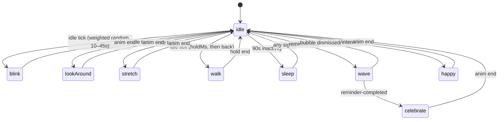

# Avatar System Design

Status: awaiting approval. No implementation yet.

## Core idea

The engine knows nothing about cats, states are **data**. Every animation lives in an
asset pack's `manifest.json`; the engine plays whatever the manifest declares. Swapping
cat → dog → penguin = new folder, zero code. Adding a state = new PNG + one manifest row,
zero code. This is what makes the 16-state wishlist cheap: states aren't code, they're rows.

## 1. Folder structure

```
assets/avatars/
  cat/
    manifest.json
    idle.png          # horizontal sprite strip, 1 row, N square frames
    blink.png
    walk.png          # one direction only — the player mirrors it via CSS scaleX(-1)
    sit.png
    sleep.png
    stretch.png
    happy.png
    sad.png
    wave.png
    celebrate.png
    thinking.png
    look-around.png

src/renderer/src/avatar/
  engine.ts           # AvatarEngine — pure TS, no React, no DOM, fully unit-tested
  manifest.ts         # types + manifest validation
  Avatar.tsx          # sprite player: one <div>, background-position + steps() animation
  useAvatar.ts        # wires engine ticks + IPC signals into React
```

Replaces current `stateMachine.ts` / CSS-blob `Avatar.tsx` (they were the placeholder).

## 2. Manifest / asset specification

```json
{
  "name": "cat",
  "frameSize": { "w": 256, "h": 256 },
  "animations": {
    "idle":        { "file": "idle.png", "frames": 4, "fps": 6, "loop": true },
    "blink":       { "file": "blink.png", "frames": 3, "fps": 10, "loop": false, "next": "idle" },
    "walk-left":   { "file": "walk.png", "frames": 6, "fps": 10, "loop": true },
    "walk-right":  { "file": "walk.png", "frames": 6, "fps": 10, "loop": true, "mirror": true },
    "sleep":       { "file": "sleep.png", "frames": 2, "fps": 2, "loop": true },
    "wave":        { "file": "wave.png", "frames": 6, "fps": 10, "loop": true },
    "celebrate":   { "file": "celebrate.png", "frames": 4, "fps": 8, "loop": false, "next": "idle" },
    "thinking":    { "file": "thinking.png", "frames": 1, "fps": 1, "loop": true, "effect": "bob" }
  },
  "idleActions": [
    { "anim": "blink", "weight": 4 },
    { "anim": "look-around", "weight": 3 },
    { "anim": "stretch", "weight": 2 },
    { "anim": "sit", "weight": 2, "holdMs": 8000 },
    { "anim": "walk-left", "weight": 1, "holdMs": 3000 },
    { "anim": "walk-right", "weight": 1, "holdMs": 3000 }
  ]
}
```

- `frames: 1` + `effect` ("bob" | "squash" | "float", CSS classes) = single static image still
  feels alive. **This is the MVP escape hatch**: ship with one image per state, upgrade to
  multi-frame strips later without touching code.
- `next`: state entered when a non-looping animation finishes.
- `holdMs`: how long a looping idle action plays before returning to idle.
- `mirror`: reuse the same strip flipped — halves walk/look assets.

Asset rules (for image generation):
- One PNG per animation, horizontal strip, square frames (256×256), transparent background.
- Consistent character across all files (same proportions, palette, line weight) — chibi
  mascot style: big head ≈60%, large eyes, tail as emotion channel.
- Reads at 100–150 px, so bold shapes, no fine detail.

The generated reference sheet is a style guide, not frames — poses vary in scale/angle and
sit on a dark background. Plan: slice + chroma-key it into a rough placeholder pack so
engine work can proceed with real art; regenerate clean transparent strips per animation
afterward and just drop them in.

## 3. State machine

States = manifest animation ids. Only `idle` is special (home state). Three transition
sources, by priority:

1. **Signals** (external, always win): `reminder-due` → `wave` (loops until bubble
   dismissed), `reminder-completed` → `celebrate`, `interact` → `happy`, `rest` → `sleep`.
2. **Animation end**: non-looping anim finishes → its `next` (default `idle`).
3. **Idle scheduler**: every 10–45 s (random), if current state is `idle`, play one
   weighted-random `idleAction`. 90 s with no activity → `sleep`. Any signal wakes.



No instant jumps: every state change goes through the engine queue; a signal interrupts an
idle action but a lower-priority trigger never interrupts a signal-driven state.

## 4. Event flow

Reminder Engine (main process) already never touches the avatar — it publishes IPC events.
Unchanged. One adapter maps app events → engine signals:

```
scheduler (main) ──reminder:due──▶ preload ──▶ useAvatar ──signal('reminder-due')──▶ AvatarEngine
Bubble "Done"    ──complete()───▶ (local) ──signal('reminder-completed')──▶ AvatarEngine
click avatar     ───────────────▶ signal('interact')
AvatarEngine ──onChange(animId)──▶ Avatar.tsx re-renders sprite
```

Future triggers (AI chat, Outlook, weather, time-of-day, mood/XP) = new signals mapped in
this one adapter, or a layer above the engine that decides which signal to send. Engine
API doesn't change. Accessories later = second sprite layer in Avatar.tsx. None of this is
built now — the seam is just where it will bolt on.

## 5. TypeScript interfaces

```ts
// manifest.ts
export interface AnimationDef {
  file: string
  frames: number
  fps: number
  loop: boolean
  next?: string
  mirror?: boolean
  effect?: 'bob' | 'squash' | 'float'
}

export interface IdleAction {
  anim: string
  weight: number
  holdMs?: number
}

export interface AvatarManifest {
  name: string
  frameSize: { w: number; h: number }
  animations: Record<string, AnimationDef>
  idleActions: IdleAction[]
}

// engine.ts
export type AvatarSignal = 'reminder-due' | 'reminder-completed' | 'interact' | 'rest' | 'wake'

export interface EngineOptions {
  random?: () => number        // injected for deterministic tests
  minIdleMs?: number           // default 10_000
  maxIdleMs?: number           // default 45_000
  sleepAfterMs?: number        // default 90_000
}

export class AvatarEngine {
  constructor(manifest: AvatarManifest, opts?: EngineOptions)
  readonly current: string
  signal(s: AvatarSignal): void
  animationEnded(): void                        // called by player for non-looping anims
  onChange(cb: (anim: string) => void): () => void
  start(): void
  stop(): void
}
```

Renderer plays strips natively — no canvas, no rAF:

```css
.sprite {
  background-image: url(idle.png);
  animation: play 0.66s steps(4) infinite;   /* frames/fps from manifest */
}
@keyframes play { to { background-position-x: -1024px; } }
```

## 6. Implementation plan (after approval)

1. **Placeholder pack**: script slices the reference sheet, keys out the dark background →
   `assets/avatars/cat/` with mostly 1-frame animations + effects. Manifest written by hand.
2. **engine.ts + tests**: transitions, signal priority, idle scheduling (injected
   random/clock), sleep timeout, wave-until-dismissed. Port existing state machine tests.
3. **Avatar.tsx sprite player**: steps() animation, mirror, effect classes,
   `animationEnded` via `onAnimationEnd`.
4. **Wire signals** in useAvatar; delete old stateMachine.ts/useAvatar.ts/CSS-face.
5. **Verify**: unit tests, e2e smoke, screenshot each key state.
6. **Later** (not now): clean per-animation strips, screen-roaming walk (window.setPosition),
   look-at-cursor (screen.getCursorScreenPoint), mood/XP, accessories, avatar picker in settings.

## Deliberate cuts

- 16 named states → whatever the asset pack ships; engine doesn't care. MVP pack ≈ 12.
- Walking = inside the window for MVP; screen-roaming is a later, isolated feature.
- No animation queue beyond current+next — desktop pet, not a fighting game.
- No mood/XP/accessory fields in manifest yet — extension points documented instead.
